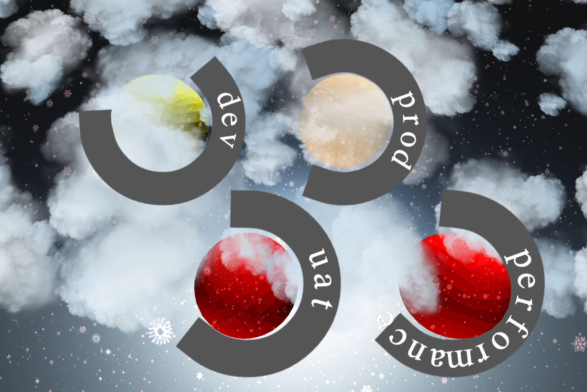

# Balls

A 3D build radiator worth looking at.

Build radiators needs to be fun. Anyone can develop plain old html/css grid based view.
That stuff is like flash, old and needs to be replaced.

Put this on your TV, and you will never go back to any other build radiator.

### Screenshots - That do not do justice

### Supported CI Servers

Thanks to [clj-cctray](https://github.com/build-canaries/clj-cctray)

	1.  GO
	2.  Jenkins
	3.  Hudson
	4.  Travis
	5.  Snap
	6.  Circle
	7.  Team City
	8.  Cruise Control.rb
	9.  CruiseControl
	10. CruiseControl.NET
	11. Solano

### Setup without server side config

	1. lein ring server
	2. launch browser at <hostname>:3000
	3. Setup config right there.

	Since the config is UI based, different teams have full control over their configuration.

### Setup with server side config

	1. Copy config.json.sample to config.json under resources/config.
	2. Set url, include/exclude regex.
	2. lein ring server
	3. launch browser at <hostname>:3000

	You cannot override cctray url. You can still do custom include/exclude from browser.

### Security
	Well not really. Just a workaround.

	It is only needed if your CI server requires username/password. Ignore otherwise.

	1. Create resources/config/username file.
	2. Create resources/config/password file.
	3. Start the radiator server and delete the files afterwords.

	The server keeps things in memory and uses it to send requests to CI server.
	So, if you need to restart radiator server again, the credential files will need to exist at time of startup.

	Note: Only tested with Go CI Server.

### Sounds

Sounds are played on 2 different events.

	1. When the build breaks.
	2. When the build succeeds after it breaks.

To have your custom sounds available:

	1. Copy your audio file(s) in resources/sounds folder. No need to restart the server.
	2. Reload the page.
	3. Select audio in controls.

You always have the ability to switch on/off either or both sounds.

### Ball Colors

1. Green is healthy.
2. Yellow is building.
3. Red is broken.
4. Orange is building after being Red.

### Shapes

Not everyone prefers a ball. You can select one of the following shapes or let the app select one randomly.

	ball, icosahedron, torus, cylinder, cone, coil, tetrahedron, octahedron or random

### Weather

The monitor displays weather conditions based on the status of your builds.

	sunny, cloudy, rainy, snow, blizzard

	meteor showers(coming soon)

### Events
People sometimes prefer to have sounds switched off.
These events are meant to attract your attention to broken builds visually.

1. Red alert (if 5 or more broken builds, configurable).
2. Glitch effect (if 6 or more broken builds, configurable).

### Timed Events
These are events (play video or sound) that are executed once a day, at a configurable time, during weekdays.
Currently available timed events:

	stand up.

	Custom timed events to be implemented.

### UI Controls

	- Sound selection when build goes Red.
	- Sound selection when build goes from Orange to Green.
	- Custom Shapes
	- Toggle text rotation.
	- Attraction/Repulsion for all the green balls.
	- Custom thresholds for events.
	- Custom colors. (to be implemented).

### Coming soon

In the order in which they came to my mind.

	- Make weather conditions based on some statistics and not just simple thresholds.
	- Blame animations. (to be switched off by default)
	- Webcam/Mic input. (I have a cunning plan)
	- Interactive balls. (low on priority, its a radiator first)
	- Statistics (Eg. who broke the most builds. If your team member, takes this personally, then .... switch if off.)
	- Highlight inactive builds. (and not just by making them gray).
	- Display FPS (this is easy, should have done it from the start).
	- Special animations for when A Build breaks way too many times.(Can build on this for other scenarios.)

### Known issues

1. If webgl is not supported by browser/machine, it will not work.
   Use [nevergreen](https://github.com/build-canaries/nevergreen).

2. Local storage is required to save your config and UI controls.

3. The radiator has been tested with 200 simultaneous builds.
   If you suffer performance issue, filter pipelines out.

4. WebGl may not work nicely for long period of time.
	Depending on your client machine, you may see messages like ` Webgl hit a snag ` or ` Lost Webgl context `.
	Only solution at this time is to just reload the page.
	This is an inconsistent behavior and I have personally seen it happen only on 1 machine that was over 5 years old.
	Like an old saying by a developer, "It works on my machine....".

### License

Distributed under the Eclipse Public License.
